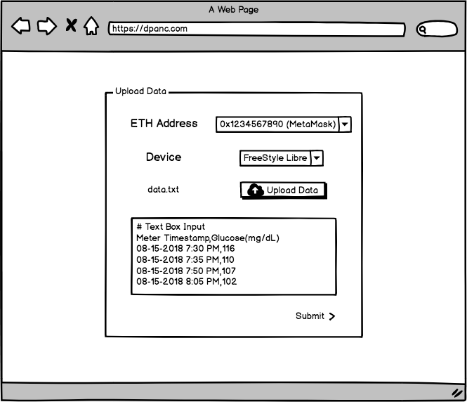
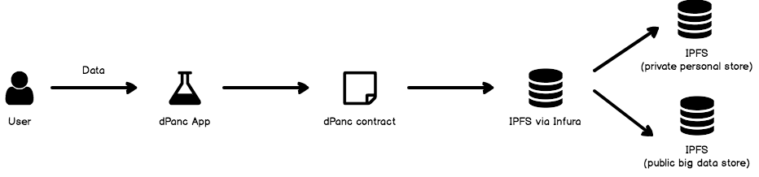

# dPanc

## Description
dPanc aims to leverage Ethereum network's distributed and immutable nature to provide a platform for diabetics to monitor their health.

## Today's Problem
Today in the US, a diabetic patient will typically visit their doctor for a checkup once every few months.

The standard checkup involves testing and recording the patient's blood glucose level, and comparing the results with data from previous visits.

If the patient can afford to own a blood glucose testing kit and has the ability to export/record the data from the device, then the doctor can assess the patient's situation better as there are more data points to build a better model of the patient. If not, then the doctor has to rely on the data generated every visit.

A person's blood glucose level can be affected by many different factors such as diet, exercise, and sleep. There is a general "acceptable" range for blood glucose level, but adjusting the level depends on a person-to-person basis so most treatment options rely on self-care.

Unfortunately, the US healthcare system is incredibly expensive for patients so many type 1 diabetics will sacrifice their health to save money.

## The Solution: dPanc
dPanc's purpose is to leverage technology to empower type 1 diabetics to take full control their health.

By utilizing the Ethereum network to digitalize a user's diabetic health record, dPanc is a full end-to-end solution filling a major gap in the diabetes ecosystem.

Users will upload their measurements via file or manual entry, and receive a a health report including comparisons to previous uploads and other users with similar lifestyles.

## MVP Features
- "One Month Report"
  - Avg glucose level
  - Max velocity
  - Graph of avg glucose level by time
  - Anomaly detection
- MetaMask integration
- Global view of statistics

## Full Product
- Machine learning model/module to give recommendations
- Ability to enter timestamped data for any period of time
- Mobile app to enter measurements on the go

## Technical Details

### Tech Stack
dPanc is a full end-to-end service and platform featuring:
- Node.js web application
- Infura for access to Ethereum and IPFS
- Solidity contract for uploading/retrieving patient data on IPFS
- Java service for patient data batching & aggregation

### Web Application

Users will interact with a Node.js web application integrated with web3 via infura/MetaMask. Users will fill out a simple form and attach their measurements to generate their report.

The user will then be redirected to the Report page where they can view their results.

### Data Flow

A user's upload will go through a Solidity contract to be stored in two data stores in IPFS:
- private personal store 
- public big data store

The private personal store is a history of a user's data (by ethereum address). This store is only accessible by the user (ethereum address) that uploaded the data.

The public big data store is a global store of everybody's measurements. Once a day or so, the Java service will collect all submitted data to strip out any identifying details and do a batch upload of all the data into the public big data store.

The purpose of the public big data store is to provide an easy way to access the big data to apply machine learning models, and expose this valuable dataset to researchers.